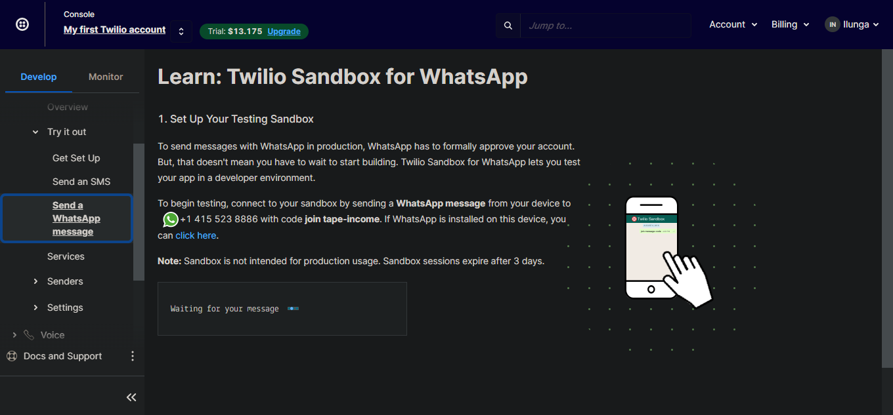
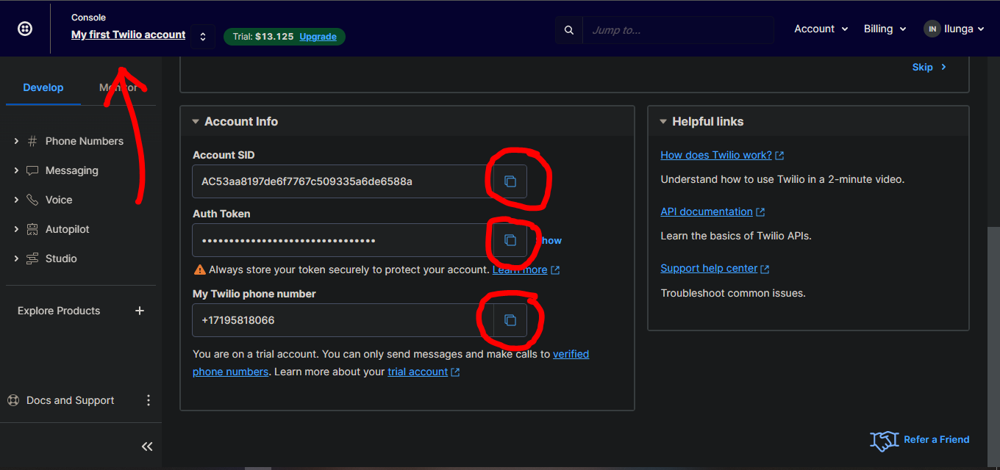
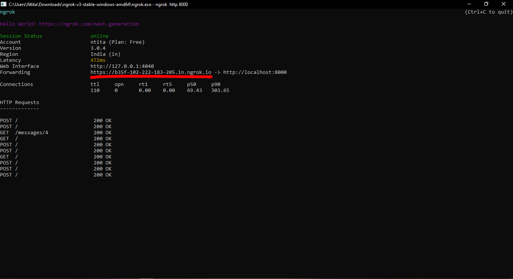
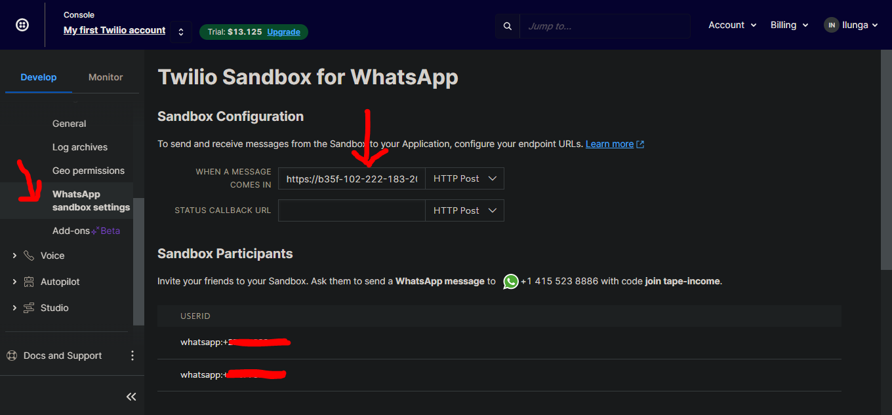

# django-whatsapp-bot

## These instructions assume a linux or wsl environment

1. sudo apt-get install python3-pip
2. sudo pip3 install virtualenv
3. virtualenv venv
4. source venv/bin/activate
5. pip install -r requirements.txt
6. python manage.py migrate
7. python manage.py runserver


## These instructions assume a Windows environment

1. Install python form "https://www.python.org/downloads/windows/"
2. In your terminal: pip install virtualenv
3. Inside the app folder: virtualenv venv
4. To activate the virtual environment: venv/bin/activate
5. pip install -r requirements.txt
6. python manage.py migrate
7. python manage.py runserver

## To setup Twilio
1. First create an account with Twilio if you don't already have one from: https://www.twilio.com/try-twilio
2. When you have successfully created your twilio account, you will be transfered to this page. Follow the steps on this page to activate your twilio sandbox.

3. Create a new file .env inside bot/ folder.
Declare these environment variables in .env

```python

TWILIO_ACCOUNT_SID = 
TWILIO_AUTH_TOKEN = 
TWILIO_NUMBER = 
```
4. Click on my first Twilio account and you will be redirected to the twilio whatsapp console. From this we will need to copy the Account SID, the Auth Token and the Twilio number and paste them in bot/.env. Like:


```python

TWILIO_ACCOUNT_SID = AC53aa8197de6f7767c509335a6de6588a
TWILIO_AUTH_TOKEN = the auth token here
TWILIO_NUMBER = +14155238886
``` 
5. Now we need to setup our tunnel so that our app is connected to the twilio sandbox. We need to create an account with https://ngrok.com/
6. Download ngrok for your system and run it, since our app is running on localhost port 8000 run this command `ngrok http 8000`. Copy the `Forwarding  url`

7. Finally on the twilio dashboard, under the Develop tab, locate the whatsapp sandbox settings and click on it. You will be redirected to the settings page. Here we need to paste the url we copied from ngrok and paste it in `WHEN A MESSAGE COMES IN`. now we are done and ready to use our whatsapp bot

8. On whatsapp inside your twilio bot, send a simple "hello" and the bot will reply to you.
9. To view all your discusions with the bot, once again just open the url you copied from ngrok or use http://127.0.0.1:8000/


## To skip the process
#### I have already setup a twilio whatsapp bot running on my ngrok tunnel.
1. On whatsapp add this number "+14155238886"
2. Send "join tape-income"
3. Finally send a simple "Hi or Hello"
4. To view conversations visit: https://b35f-102-222-183-205.in.ngrok.io